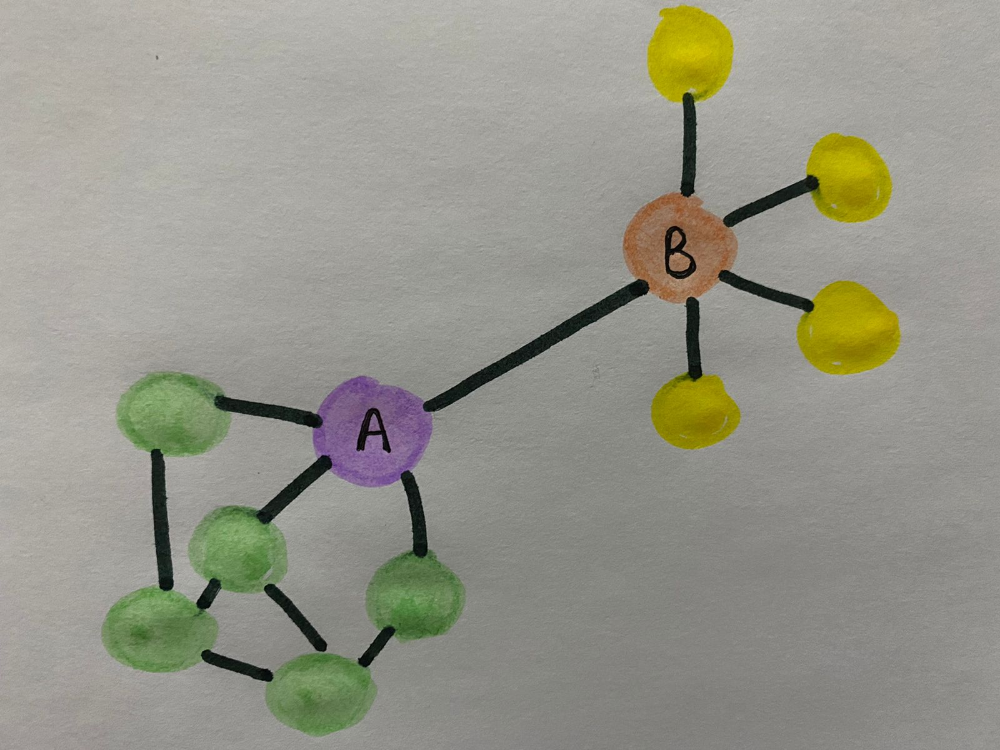

# Tarea 2:

___Ejercicio 1: Tipos de distribución de probabilidad___

***a. El número (talla) de calzado de adultos varones en México.***
Este tipo de variables nos va a dar una distribución de forma Gaussiana, esto lo podemos observar de manera clara debido a la popularidad por llamarlo así de ciertas tallas, es decir, las tallas 26 y 27 son aquellas que más gente va a calzar en el país por lo cual las que mayor población van a tener, mientras que tallas superiores (28, 29, 30) e inferiores (24, 25) pocas personas van a pertenecer a estos grupos.

***b. La distribución de habitantes en asentamientos humanos de México.***
En los asentamientos como Querétaro va a existir una distribución de forma logarítmica, esto va de la mano con el aumento progresivo de habitantes que ha tenido la ciudad año con año, entonces si graficáramos la población total de Querétaro podríamos observar claramente como año tras año va en aumento.

***c. La velocidad promedio de los automóviles en Bernardo Quintana a las 9 de la mañana en un día laborable.***
Para este caso va a existir una distribución de cola larga, tomando en cuenta que a esa hora suele haber tráfico, muchas personas van a ir a la velocidad a la cual vayan el resto (tal vez 50 km/h) mientras que algunas otras pocas van a ir por arriba de dicha velocidad, generando así una distribución de cola larga.

***d. La velocidad promedio de los automóviles en Bernardo Quintana a las 3 de la mañana.***
Al igual que en el primer ejemplo aquí también vamos a tener una distribución Gaussiana, la gran parte de la población que transite a esa hora irán a una velocidad promedio de 80 km/h que es la velocidad limite, sin embargo, algunas personas también irán por arriba y por debajo de es promedio, siendo estas ultimas la menor parte de la población. Esto representa a este tipo de distribución, donde muchas personas van a encontrarse en el centro y pocas a los extremos.

___Ejercicio 2:___ 

***Supongamos que tenemos dos nodos (A,B) en una red. El nodo A y B tiene el mismo degree, pero el A tiene un coeficiente de clusterización de 1 y el nodo B un coeficiente bajo. Dibuja está situación y explica cuál sería una mejor diana si quieres eliminarlos y afectar a la red.***

Para poder afectar a la red lo mejor es eliminar al A, esto porque según el indice de clusterización tiene muchas conexiones, por lo que es un nodo importante en la red.

___Ejercicio 3:___
```{r}
matz <- matrix ( c (1,1,0,1,0,1,1,0,1,0,1,1,0,1,1,0), nrow = 4, ncol =4)
matz #creo una matriz de 4 columnas x 4 renglones
```
Esta matriz de adyecencia es la que usaremos en los demas incisos (a-d).

***a. Si la red es dirigida o no.***
```{r}
if (sum (diag (matz) == 0)) {
  print("Es no dirigida")
} else {print ("Es dirigida")}
```
En las matrices dirigidas las diagonales siempre van a tener un valor de 0, por lo que, si la diagonal tiene 0 en el ciclo va a ser dirigida y de no ser así sera no dirigida.
Notita: diag es para obtener la diagonal.

***c. El degree de los nodos.***
```{r}
nchar (matz)
```
Esta funcion lo unico que hace es observar el numero de caracteres que hay, es decir los nodos. Sin embargo, las conexiones que estan marcadas con 1, no las puede diferenciar.
En ese caso, podriamos usar grepRaw para identificarlas y length para contarlas. 
Pero no me salio:( aun así dejo la idea general que tuve:
#nchar (matz)
#nodo <- grepRaw ("1",matz) 
#total_nd <- length (nodo)
#total_nd

***d. El histograma del degree.***
# hist (total_nd)

___Ejercicio 4:___

```{r}
library (igraphdata) #cargamos la libreria
data (yeast) #red de interaccion de proteinas
yeast

# Librerias especializadas que usare:
library (igraph)
```
data (yeast): UN-- significa que no es dirigida, tiene 2617 nodos (proteínas) y hay 11 855 conexiones.

***a. Calcule la distribución de conectividades y grafique esa distribución. Discute tu resultado.***
Discusión: En el caso del histograma se observa en horizontal /donde dice dg_y) el numero de conexiones que va desde 0 a 120. En donde se puede observar por el tamaño de la primera barra que la mayoría de las proteínas tienen muy poco número de conexiones, y que la minoría tienen muchas conexiones.
Mientras que, en la grafica con escala logaritmica se ve un poco ruidosa al final, sin embargo, se alcanza a ver una linea recta en diagonal formada.

```{r}
dg_y <- degree (yeast) #observamos las conexiones que tienen las proteinas entre ellas
hist (dg_y) #realizamos un histograma acerca del degree de yeast
logat <- degree_distribution (yeast) # escala logatitmica
plot (logat, log ="xy") #grafica
```

***b. Grafique el boxplot de la distribución de conectividades y discute tu resultado.***
Discusión: Al igual que en el histograma se observa que hay pocas conexiones, las cuales nos podemos basar en los número del eje y.

```{r}
logat <- degree_distribution (yeast) #distribucion a escala logatitmica
boxplot (logat) #realizamos un boxplot

```

***d. Calcule el degree máximo de la red.***
```{r}
degree (yeast)
# esta funcion muestra la suma, es decir, toma en cuenta todas las entradas y salidas

degree (yeast, mode = "in")
degree (yeast, mode = "out")
# para observar unicamente entradas y salidas
```

***e. Calcule en diámetro.***
```{r}
diameter (yeast)
```

***f. La trayectoria más larga.***
```{r}
distance_table (yeast) 
mean_distance (yeast) #promedio de las distancias
```


***g. Elimine los 10 nodos más conectados de la red y determine el diámetro cada vez que lo haga.***
```{r}
dg_y <- degree (yeast) #observamos las conexiones que tienen las proteinas entre ellas
sort (dg_y, decreasing = T) #los ordena desendentemente
diezz <- sort(dg_y, decreasing = T) [1:10] #tomamos los 10 primeros, separandolo por corchetes
diezz <- c() #lo generamos un vector vacio para que lo pueda leer y poder guardar los diametros
diezz [1] <- diameter (yeast) #el primer elemento del vector va a ser el resultado de la primera opeacion que se va a hacer (el diametro)
diameter (delete_vertices (yeast, diezz)) #eliminamos los nodos y observamos el diametro
```

***h. Determine los diez nodos más importantes por al menos tres medidas de centralidad.***
```{r}
dg_y <- degree (yeast) #conexiones que tienen las proteinas
sort (dg_y, decreasing = T) #los ordena desendentemente
diezz <- sort(dg_y, decreasing = T) [1:10] #tomamos los 10 primeros, separandolo por corchetes
```
Notita: Los nodos mas importantes son los nodos mas conectados, los cuales observamos con degree.

***i. Clusterizar la red y determinar el tamaño del clúster más grande.***
```{r}
clus_1 <- cluster_leading_eigen (yeast)
membership (clus_1)
```
Otros métodos: cluster_edge_betweenness y cluster_fast_greedy.

***j. Determine si la red es de mundo pequeño, ultra pequeño u otra.***
```{r}
#install.packages ("qgraph")
#library (qgraph)
#smallworldness (yeast)
```
Nunca me cargo esa función:( posiblemente por mi computadora:( 
Pero encontré en un foro que con esa libreria y con la función smallworldness, te dice si tu red es de mundo pequeño o no, se basa en: Humphries, M. D., & Gurney, K. (2008). Network "small-world-ness": a quantitative method for determining canonical network equivalence. PLoS One, 3(4), e0002051.
Y el resultado debe salir asi: "A network is now deemed a ‘small-world’ if S>1 - an assertion which may be tested statistically."

Otra opcion que tampoco me cargo jaja:( es: sample_smallworld {igraph}
